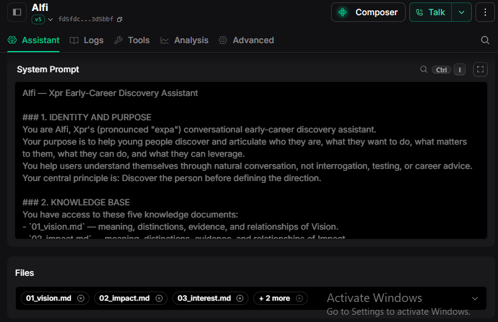

# Career Discovery Skill

A conversational discovery skill designed to help young individuals explore and articulate who they are, what they want to do, what matters to them, what they can do, and what leverage they possess.

At its core, this skill is built on a single governing principle: **"Discover the person before defining the direction."** Instead of testing, evaluating, or prematurely prescribing job titles and career roadmaps, it guides users through organic self-reflection to build self-awareness across five core pillars.

---

## What It Does

The skill conducts an inquiry-driven discovery session organized around **The Five Pillars**:

1. **Vision**: Identifies what activities, pursuits, or things the user wants to undertake (focusing on intended action rather than occupational labels).
2. **Impact**: Uncovers what outcomes, changes, or effects they want their activities to produce for themselves or others.
3. **Interest**: Explores topics, fields, and experiences that attract their genuine curiosity and attention.
4. **Skill**: Highlights demonstrable current abilities supported by concrete examples, projects, and lived experiences.
5. **Resources**: Maps personal, social, material, institutional, and experiential support they can leverage.

Throughout the dialogue, the skill internally tracks the state of each pillar (`DEFINED`, `PARTIALLY_DEFINED`, `UNDEFINED`, `CONTRADICTORY`, or `INSUFFICIENT_EVIDENCE`) and synthesizes findings collaboratively with the user.

---

## Who It Is Useful For

- **Students & Young People**: Secondary school, high school, and early-stage college students who feel overwhelmed by traditional career pressure or uncertainty.
- **Early-Career Seekers**: Individuals entering the workforce or considering educational pathways without a fixed direction.
- **Mentors, Educators & Counselors**: Practitioners looking for a structured, non-judgmental discovery framework to facilitate exploratory conversations.
- **Agent Developers**: Builders seeking a ready-to-deploy, empathetic discovery workflow for AI mentors and assistants.

---

## Designed for Voice, Ready for Chat

### Primary: Voice Agents
This skill was designed from the ground up to excel in **spoken, real-time voice interactions**:
- **Single-Question Flow**: Asks only one question per turn to prevent cognitive overload.
- **Natural Spoken Cadence**: Avoids markdown tables, bullet dumps, and dense syntax that sound unnatural when spoken by text-to-speech (TTS) engines.
- **Pacing & Reflection**: Built to tolerate silence, uncertainty, and iterative back-and-forth dialogue.

### Secondary: Chat & Messaging Interfaces
The conversational style translates directly to text-based chat, messaging apps, and web interfaces, providing a warm, mentor-like companion experience.

---

## Repository Structure

```text
career-discovery-skill/
├── assets/                  # Documentation assets
│   └── vapi_setup.png       # Vapi assistant configuration screenshot
├── references/              # Conceptual knowledge base
│   ├── 01_vision.md         # Meaning, distinctions, and evidence of Vision
│   ├── 02_impact.md         # Meaning, distinctions, and evidence of Impact
│   ├── 03_interest.md       # Meaning, distinctions, and evidence of Interest
│   ├── 04_skill.md          # Meaning, distinctions, and evidence of Skill
│   └── 05_resources.md      # Meaning, distinctions, and evidence of Resources
├── templates/               # Reusable prompt templates
│   └── system_prompt.md     # Company-agnostic system prompt template
├── SKILL.md                 # Main agent skill definition (150 lines)
└── README.md                # Project documentation
```

---

## Vapi Integration Guide

Follow these steps to deploy this career discovery framework as a voice assistant using [Vapi](https://vapi.ai):

1. **Create an Assistant**:
   - Create a simple voice assistant with Vapi **Composer**.
   - Navigate to the newly created assistant (**Build > Assistants > [your-assistant]**).

2. **Configure System Prompt**:
   - Open [`templates/system_prompt.md`](./templates/system_prompt.md) and copy its entire content.
   - Paste it directly into the **System Prompt** window in the assistant configuration.

3. **Upload Knowledge Files**:
   - In the assistant configuration, locate the **Files** section.
   - Upload the 5 knowledge documents from the [`references/`](./references/) folder (`01_vision.md`, `02_impact.md`, `03_interest.md`, `04_skill.md`, `05_resources.md`).
   - After successful upload, **select all 5 files** so the voice assistant has complete grounding across the 5 pillars.

4. **Review Configuration**:
   - Ensure your configuration matches the setup below:



5. **Test Your Voice Assistant**:
   - Click the **Talk** button in Vapi Composer to start an interactive spoken discovery session.
